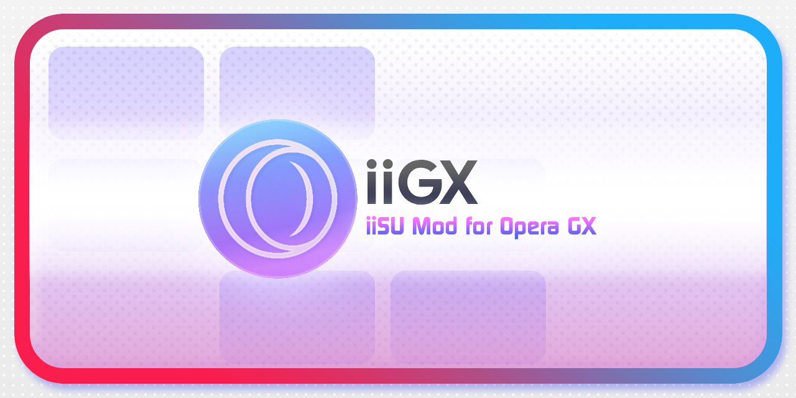
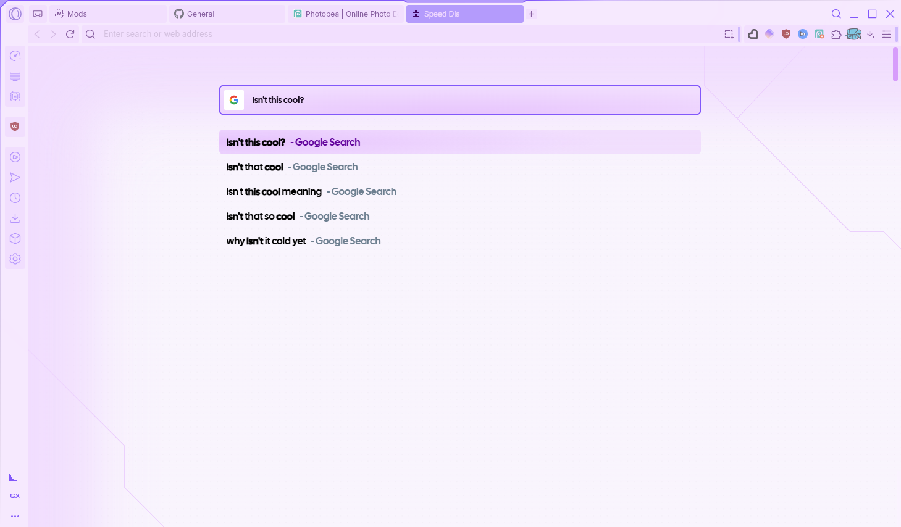
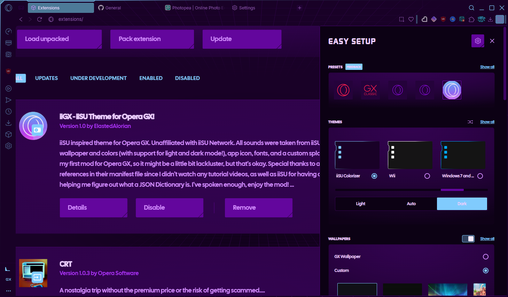

# What is iiGX?
This is a mod that attempts to bring an iiSU-esque experience to Opera GX. It is kind of random that I settled on Opera GX for this, but Opera GX is meant for gamers (like iiSU) and then it's also easy to customize, allowing stuff like custom colors and all that pizazz. (And it's also multiplatform unlike iiSU, haha.)

## Features
This features things such as:
- Background Music and SFX (Taken from iiSU 0.4.1)
- Custom fonts (Cal Sans and Continuum, however the former shows up in more places.)
- Cool colors! (Theme.)
- Four App Icons
- Three Splash Screens
- 2 Wallpapers (One for dark and light mode respecively.)

Things I will ***not*** add:
- Game Strips (I have no need to.)
- Icons (They're handled in JSON files of their own, and I do not understand ANYTHING about how they work. Also iiSU lacks a lot of graphics.)
- Cursors (Unless iiSU adds cursors of their own, but I doubt that.)
- Stickers (What would I even put there?)
- Effects (Little documentation and no desire to.)

## Issues
- Wonky with the YouTube Recolor mod.
    - Background turns purple on home screen when in dark mode.
    - I do not know if light mode is meant to be impacted, but it's unchanged.

## How to load the mod?

This should be on the GX Store by the time you read this, but if you want to make your own changes or don't want to download the theme through there, you can download it through here.
The following instructions are unchanged from Opera's loading sample mods section.

1. Open _Extensions view_ (opera:extensions)
2. Enable _Developer mode_ in top right corner
3. Click _Load unpacked_ and point to directory with manifest.json
4. Loaded mod will shown in _Mods view_ (opera:mods)

## Preview
- Splash Screens 
### Light Mode

### Dark Mode

